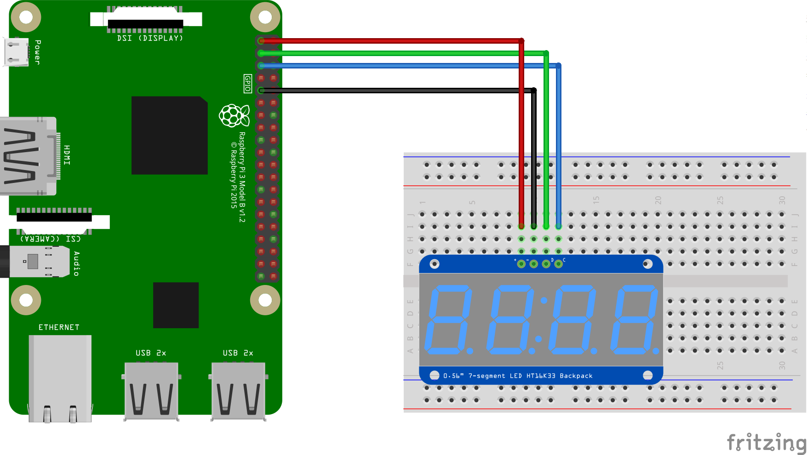

Segment display sample for Android Things
=========================================

This Android Things sample demonstrates how to use a segment display based on
the HT16K33 chip with an I2C backpack.


Screenshots
-----------

![Segment display sample demo][demo-gif]

[(Watch the demo on YouTube)][demo-yt]

Pre-requisites
--------------

- Android Things compatible board
- Android Studio 2.2+
- [Rainbow Hat for Android Things](https://shop.pimoroni.com/products/rainbow-hat-for-android-things) or the following individual components:
    - 1 [HT16K33 based segment display with I2C backpack](https://www.adafruit.com/product/1270)
    - jumper wires
    - 1 breadboard

Schematics
----------

If you have the Raspberry Pi [Rainbow Hat for Android Things](https://shop.pimoroni.com/products/rainbow-hat-for-android-things), just plug it onto your Raspberry Pi 3.



Build and install
=================

On Android Studio, click on the "Run" button.

If you prefer to run on the command line, from this repository's root directory, type

```bash
./gradlew ht16k33:installDebug
adb shell am start com.example.androidthings.driversamples/.SegmentDisplayActivity
```

If you have everything set up correctly, the segment display will show "ABCD".

License
-------

Copyright 2016 The Android Open Source Project, Inc.

Licensed to the Apache Software Foundation (ASF) under one or more contributor
license agreements.  See the NOTICE file distributed with this work for
additional information regarding copyright ownership.  The ASF licenses this
file to you under the Apache License, Version 2.0 (the "License"); you may not
use this file except in compliance with the License.  You may obtain a copy of
the License at

  http://www.apache.org/licenses/LICENSE-2.0

Unless required by applicable law or agreed to in writing, software
distributed under the License is distributed on an "AS IS" BASIS, WITHOUT
WARRANTIES OR CONDITIONS OF ANY KIND, either express or implied.  See the
License for the specific language governing permissions and limitations under
the License.

[demo-yt]: https://www.youtube.com/watch?v=OiPkBVN_ulc&index=19&list=PLWz5rJ2EKKc-GjpNkFe9q3DhE2voJscDT
[demo-gif]: https://storage.googleapis.com/android-things/samples-gifs/ht16k33.png