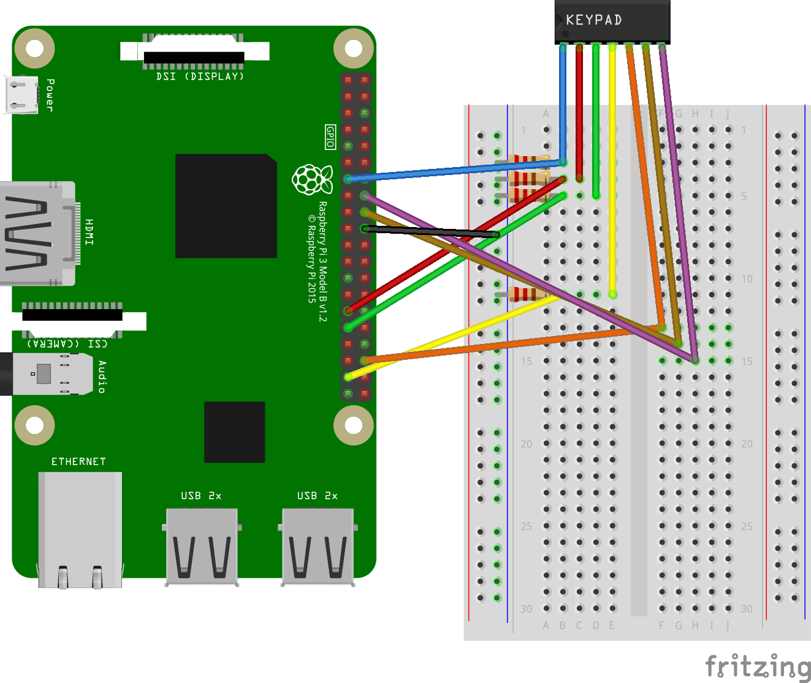

# Matrix Keypad sample for Android Things

This sample demonstrates how to receive events from a matrix keypad with Android Things.

## Pre-requisites


- Android Things compatible board
- Android Studio 2.2+
- 1 [matrix keypad](https://www.adafruit.com/products/419)
- jumper wires
- 1 breadboard
- 4 resistors (any impedance should be fine)

### Example wiring diagram


See the schematic above as a reference for how to wire the matrix keypad.
Note that the first four pins, for each row, are connected to ground with
a resistor.

## Build and install

On Android Studio, click on the "Run" button.

If you prefer to run on the command line, from this repository's root directory, type

```bash
./gradlew matrixkeypad:installDebug
adb shell am start com.example.androidthings.driversamples/.MatrixKeypadActivity
```

If everything is set up correctly, you will see key events be logged for every button you
push on the keypad.

### Using a UI
A user interface is optionally available, allowing the user to print
keys on the screen. To use this mode, set the value of `USE_LAYOUT` to `true`
in `MatrixKeypadActivity.java`.

## License

Copyright 2017 The Android Open Source Project, Inc.

Licensed to the Apache Software Foundation (ASF) under one or more contributor
license agreements.  See the NOTICE file distributed with this work for
additional information regarding copyright ownership.  The ASF licenses this
file to you under the Apache License, Version 2.0 (the "License"); you may not
use this file except in compliance with the License.  You may obtain a copy of
the License at

  http://www.apache.org/licenses/LICENSE-2.0

Unless required by applicable law or agreed to in writing, software
distributed under the License is distributed on an "AS IS" BASIS, WITHOUT
WARRANTIES OR CONDITIONS OF ANY KIND, either express or implied.  See the
License for the specific language governing permissions and limitations under
the License.
