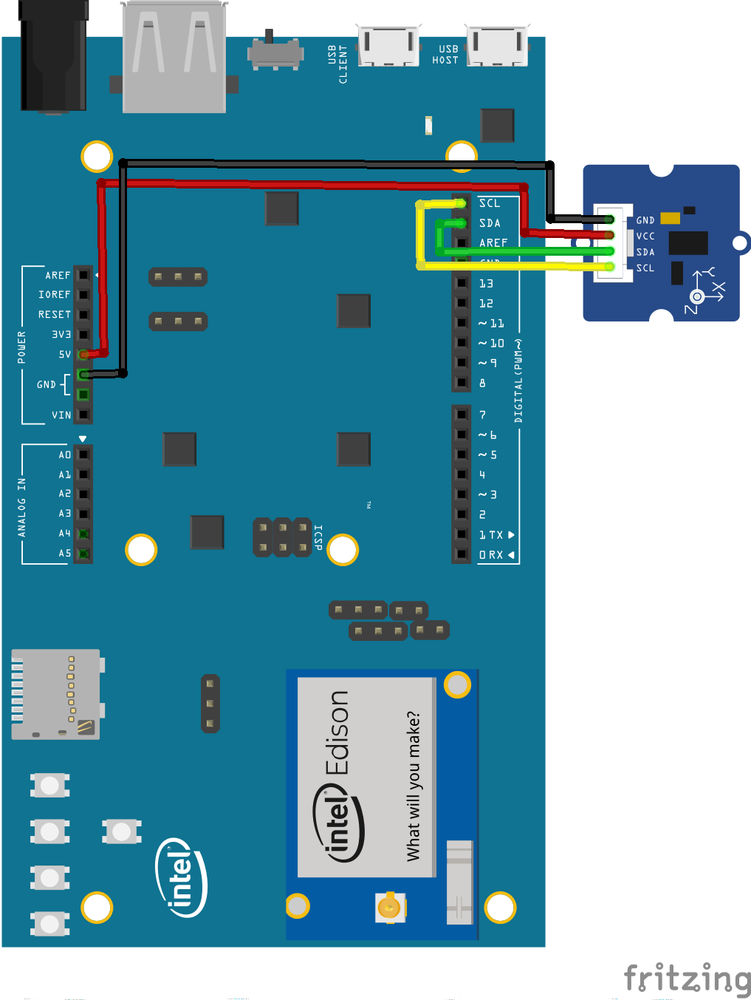
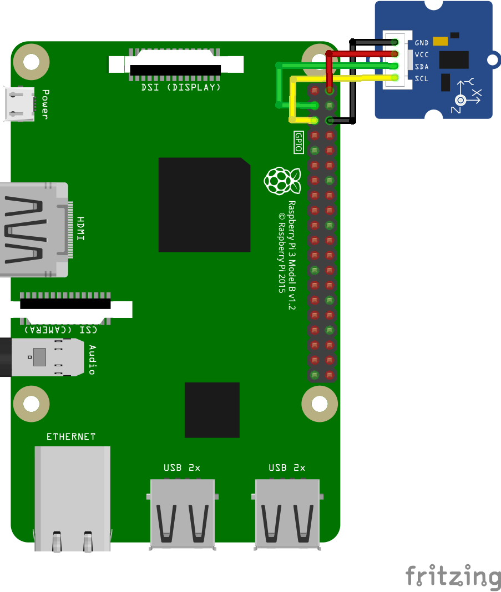

Accelerometer sample for Android Things
=======================================

This Android Things sample demonstrates how to use the MMA7660FC accelerometer
sensor and integrates it into the Android sensor framework.

Pre-requisites
--------------

- Android Things compatible board
- Android Studio 2.2+
- 1 [MMA7660FC based accelerometer](http://wiki.seeed.cc/Grove-3-Axis_Digital_Accelerometer-1.5g/)
- jumper wires
- 1 breadboard


Schematics
----------





Build and install
=================

On Android Studio, click on the "Run" button.

If you prefer to run on the command line, from this repository's root directory, type

```bash
./gradlew mma7660fc:installDebug
adb shell am start com.example.androidthings.driversamples/.AccelerometerActivity
```

If you have everything set up correctly, a log will be generated on logcat
whenever there is an accelerometer sensor update.

Notice that the Accelerometer driver integrates with the Android sensor
framework using a user driver and fuses with other sensors, so
the part of the app that handles the sensor updates works exactly the same
no matter which, or how many accelerometer sources are available.


License
-------

Copyright 2016 The Android Open Source Project, Inc.

Licensed to the Apache Software Foundation (ASF) under one or more contributor
license agreements.  See the NOTICE file distributed with this work for
additional information regarding copyright ownership.  The ASF licenses this
file to you under the Apache License, Version 2.0 (the "License"); you may not
use this file except in compliance with the License.  You may obtain a copy of
the License at

  http://www.apache.org/licenses/LICENSE-2.0

Unless required by applicable law or agreed to in writing, software
distributed under the License is distributed on an "AS IS" BASIS, WITHOUT
WARRANTIES OR CONDITIONS OF ANY KIND, either express or implied.  See the
License for the specific language governing permissions and limitations under
the License.
