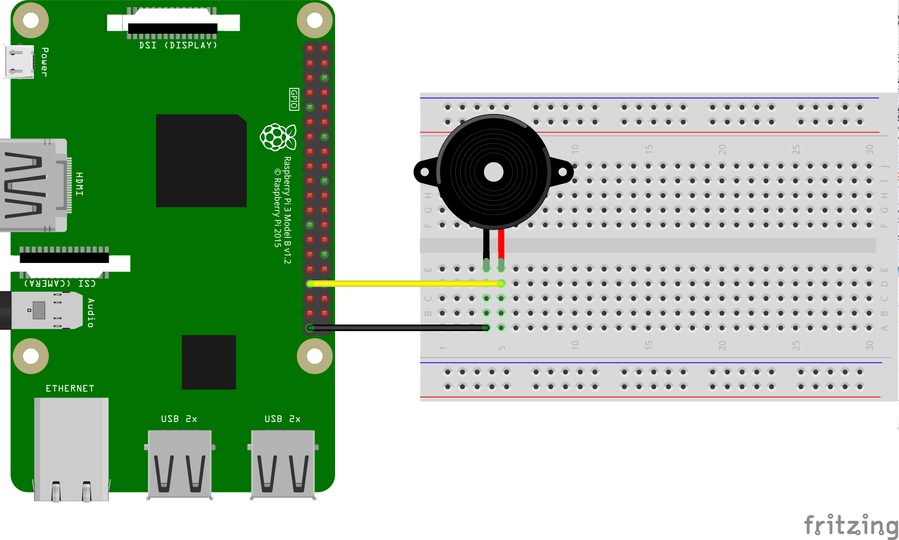

PWM Speaker Sample for Android Things
=============================================

This sample demonstrates how to control a speaker/buzzer using PWM with
Android Things.

Pre-requisites
--------------

- Android Things compatible board
- Android Studio 2.2+
- [Rainbow Hat for Android Things](https://shop.pimoroni.com/products/rainbow-hat-for-android-things) or the following individual components:
    - 1 [Piezo Buzzer](https://www.adafruit.com/products/160)
    - jumper wires
    - 1 breadboard

Schematics
----------

If you have the Raspberry Pi [Rainbow Hat for Android Things](https://shop.pimoroni.com/products/rainbow-hat-for-android-things), just plug it onto your Raspberry Pi 3.




Build and install
=================

On Android Studio, click on the "Run" button.

If you prefer to run on the command line, from this repository's root directory, type

```bash
./gradlew pwmspeaker:installDebug
adb shell am start com.example.androidthings.driversamples/.SpeakerActivity
```

If you have everything set up correctly, you will hear the speaker play a
series of notes. To play the tune again, re-run the app from AndroidStudio.
If you prefer the command line, run again with

```bash
adb shell am start -S com.example.androidthings.driversamples/.SpeakerActivity
```

License
-------

Copyright 2016 The Android Open Source Project, Inc.

Licensed to the Apache Software Foundation (ASF) under one or more contributor
license agreements.  See the NOTICE file distributed with this work for
additional information regarding copyright ownership.  The ASF licenses this
file to you under the Apache License, Version 2.0 (the "License"); you may not
use this file except in compliance with the License.  You may obtain a copy of
the License at

  http://www.apache.org/licenses/LICENSE-2.0

Unless required by applicable law or agreed to in writing, software
distributed under the License is distributed on an "AS IS" BASIS, WITHOUT
WARRANTIES OR CONDITIONS OF ANY KIND, either express or implied.  See the
License for the specific language governing permissions and limitations under
the License.
