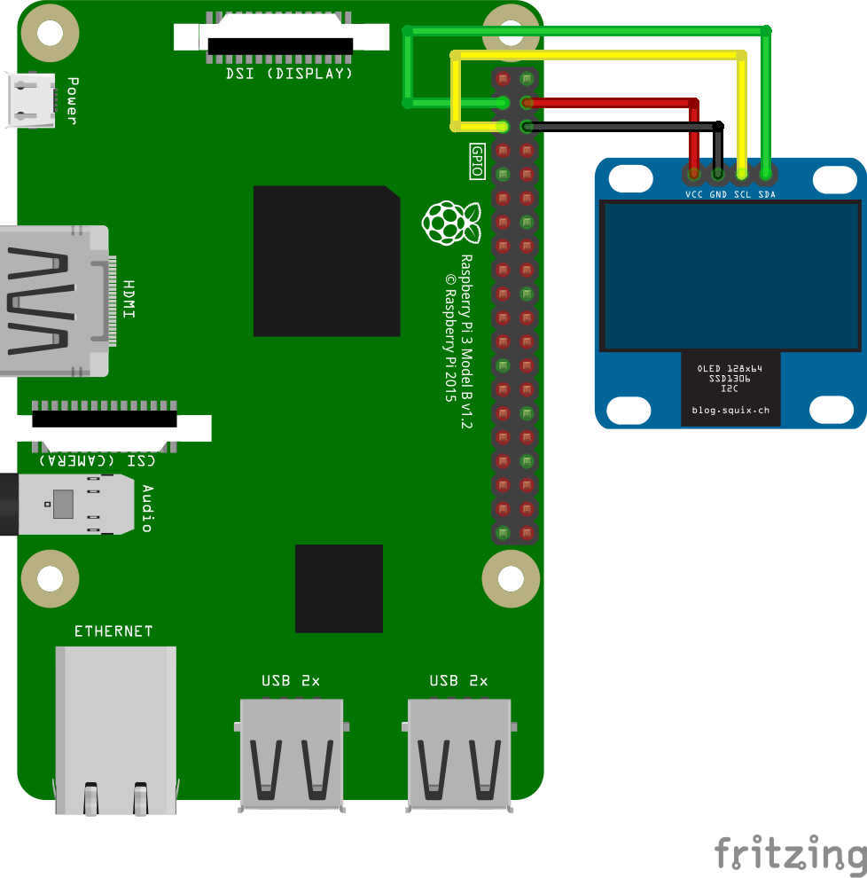

OLED Screen sample for Android Things
=====================================

This sample demonstrates how to control the SSD1306 OLED display using I2C with
Android Things.


Screenshots
-----------

![OLED Screen sample demo][demo-gif]

[(Watch the demo on YouTube)][demo-yt]

Pre-requisites
--------------

- Android Things compatible board
- Android Studio 2.2+
- 1 [SSD1306 OLED screen](https://www.adafruit.com/product/326)
- jumper wires
- 1 breadboard


Schematics
----------




Build and install
=================

On Android Studio, click on the "Run" button.

If you prefer to run on the command line, from this repository's root directory, type

```bash
./gradlew ssd1306:installDebug
adb shell am start com.example.androidthings.driversamples/.OledScreenActivity
```

If you have everything set up correctly, you will see a small bitmap slowly
moving in the screen. If you want to change the pattern displayed, change the
variable mMode in OledScreenActivity and deploy again. The sample has three
modes: DOTS, BITMAP (default) and CROSSHAIRS.


License
-------

Copyright 2016 The Android Open Source Project, Inc.

Licensed to the Apache Software Foundation (ASF) under one or more contributor
license agreements.  See the NOTICE file distributed with this work for
additional information regarding copyright ownership.  The ASF licenses this
file to you under the Apache License, Version 2.0 (the "License"); you may not
use this file except in compliance with the License.  You may obtain a copy of
the License at

  http://www.apache.org/licenses/LICENSE-2.0

Unless required by applicable law or agreed to in writing, software
distributed under the License is distributed on an "AS IS" BASIS, WITHOUT
WARRANTIES OR CONDITIONS OF ANY KIND, either express or implied.  See the
License for the specific language governing permissions and limitations under
the License.

[demo-yt]: https://www.youtube.com/watch?v=Ozrn5FEqmj0&list=PLWz5rJ2EKKc-GjpNkFe9q3DhE2voJscDT&index=22
[demo-gif]: https://storage.googleapis.com/android-things/samples-gifs/ssd1306.gif